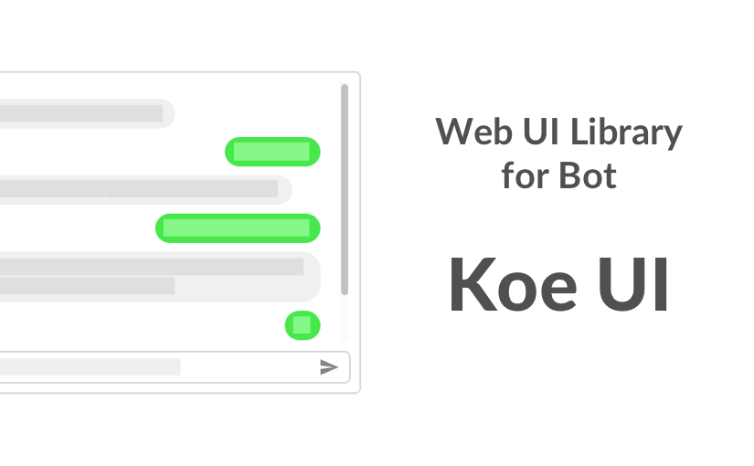
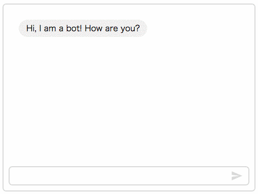

Koe-UI is **an web UI component for Microsoft Bot Framework**

This component offers an interface that **you can talk with Bot on your website**

This is made by Riot.js

##Live Demo



https://okajax.github.io/Koe-UI/basicchat.html

(Japanese language bot)


##Support Browser

* Chrome for Android: >= 50
* Android Browser: >= 50
* Chrome: >= 42
* Edge: >= 14
* Firefox: >= 39
* Opera: >= 29


##Usage

Include script files.

```html
<script src="assets/js/vender/jquery-1.12.4.min.js"></script>
<script src="assets/js/vender/riot+compiler.min.js"></script>
<script src="assets/js/koeUIcore.js"></script>
<script src="assets/js/riot-tags/koe-ui-basic.tag" type="riot/tag"></script>
<script>riot.mount('*');</script>
```

Then, put the custom tag on the place where you like.

```html
<koe-ui-basic token="_YOUR_DIRECT_LINE_API_SECRET_KEY_"></koe-ui-basic>
```

###Polling setting

You can adjust behavior of polling.

```html
<koe-ui-basic
  token="_YOUR_DIRECT_LINE_API_SECRET_KEY_"
  polling-max="120"
  polling-interval="400"
></koe-ui-basic>
```


##ToDo

- [x] use browserify, and make simple
- [x] make loading animation
